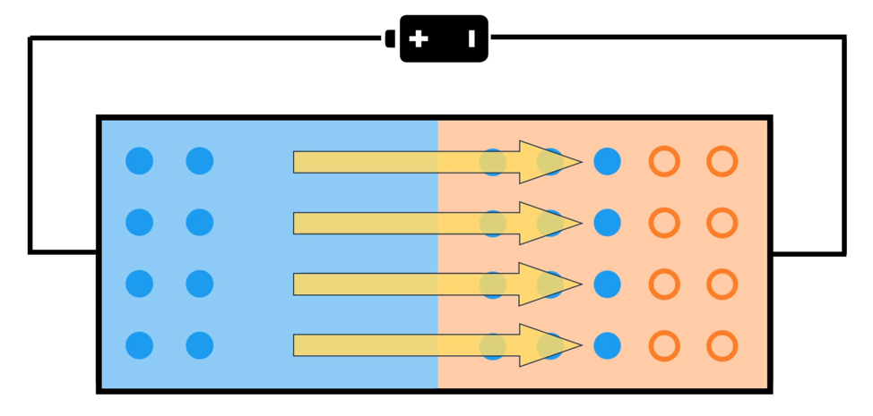
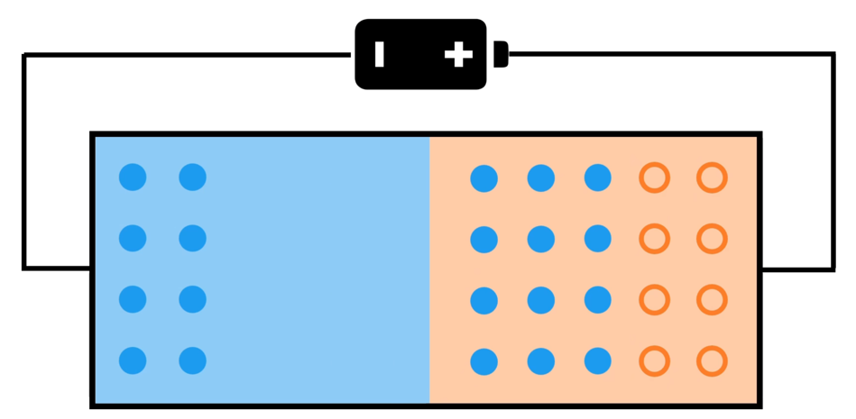
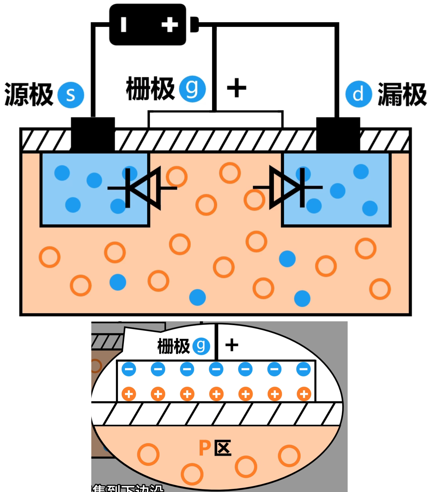
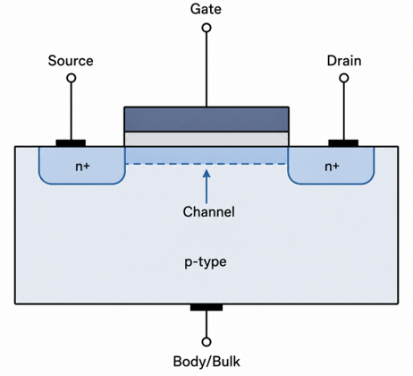
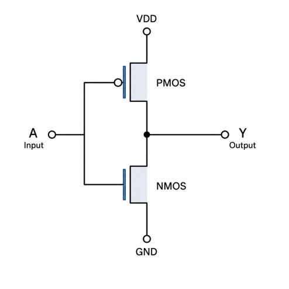
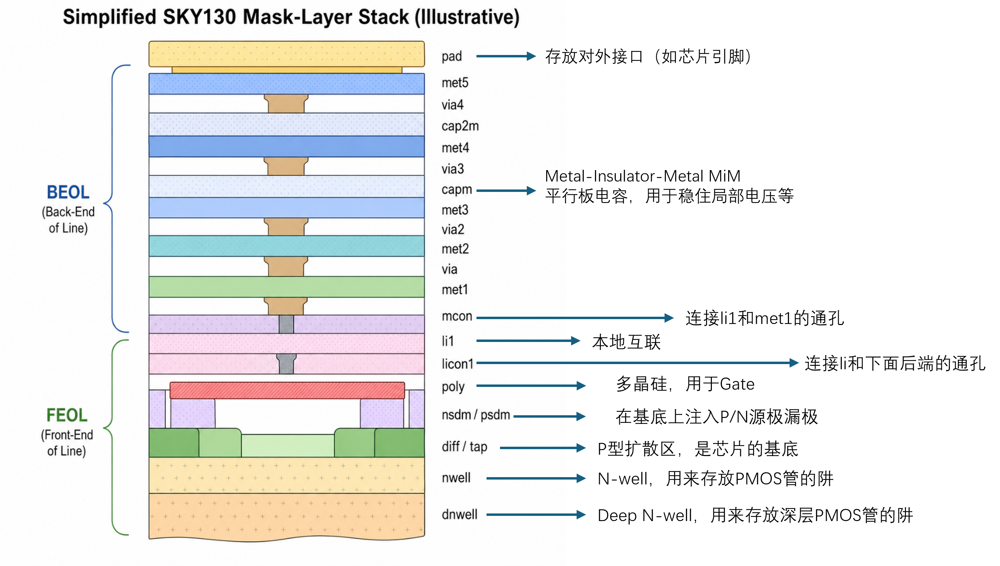
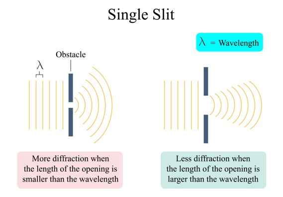

## 二极管

N级是在硅中掺了磷原子，电子多余
P级是在硅中掺了硼原子，空穴多余
正常情况下，NP级接在一起，N级电子会向P级迁移
但是这样会导致N区带正电，P区带负电，所以电场线是从N区到P区
迁移的电子越多，电场越强，直到N区的电子迁移不动，形成动态平衡
如果加上反向电压，那么会加剧电场强度，更迁移不动

当加正向电压，会抵消掉电场，二极管导通

## MOS管

未通电的MOS管可以理解成两个二极管拼在一起
正常是不能导通的
给栅极电压之后，由于异性相吸，金属板上侧聚集负离子，下侧聚集正离子，P区中的负离子（电子）被吸引到N区之间，形成Channel

这是一个NMOS管
gate 控制 source 和 drain 是否连通
Gate：栅极，控制开关
Source：源极，电流入口/出口之一
Drain：漏极，电流入口/出口之一
Body/Bulk：身体/衬底，晶体管所在的“土壤”

## NOMS PMOS CMOS

从最基础的物理器件角度看，NMOS 和 PMOS 就是把所有的材料属性翻转了一下：

NMOS（N型管）：
* 地基（衬底）： P 型硅（掺杂了硼等，内部带正电荷的“空穴”多）。
* 注入区（Source/Drain）： N+ 型（打入了磷等，内部带负电荷的“电子”多）。
* 导电主力： 电子（Electron）。

PMOS（P型管）：
* 地基（衬底）： N 型硅（内部电子多）。
* 注入区（Source/Drain）： P+ 型（打入了硼等，内部空穴多）。
* 导电主力： 空穴（Hole）。

CMOS反相器由一个PMOS和一个NMOS连接而成
当A为1时NMOS导通，Y接GND为0
当A为0时PMOS导通，Y接VDD为1

## Mask Layer

MaskLayer不能简单等同于芯片横切面，MaskLayer是光刻机作用于芯片的顺序，即一个真实芯片层可能对应多步Mask

## 光刻机的简要工作原理

芯片的制造会重复以下步骤中的某几步或全部：
* 沉积（Deposition）： 先在地基上铺一层材料
涂层（Coating）：在材料上涂一层光学敏感化学物质，叫光刻胶
* 曝光（Exposure）：把事先设计好的电路图（掩膜版Mask，相当于镂空图案的底片），用紫外光投射到晶圆上。被光照射到的光刻胶会发生化学反应，性质改变
* 显影（Development）：用化学溶剂把晶圆洗一遍，没洗掉的光刻胶留在硅片上
* 加工（Processing）
  * 刻蚀（Etching）：没被光刻胶保护的地方被腐蚀掉，形成沟槽
  * 离子注入（Ion Implantation）:用高能加速器把N型杂质离子轰击到硅基底（或者阱）中，形成N区（P区同理）

* 去胶（Stripping）：用强酸把光刻胶洗干净

### 光刻与离子注入流程

<iframe
	class="note-interactive"
	src="/interactives/transistor/photolithography-process.html"
	title="芯片光刻与离子注入工艺演示"
	loading="lazy"
></iframe>

### 多晶硅栅极形成

<iframe
	class="note-interactive"
	src="/interactives/transistor/polysilicon-gate-formation.html"
	title="芯片制造工艺：多晶硅栅极形成"
	loading="lazy"
></iframe>

### NMOS 制造全流程

<iframe
	class="note-interactive"
	src="/interactives/transistor/nmos-fabrication-process.html"
	title="NMOS 制造全流程演示"
	loading="lazy"
></iframe>

## Mask与GDS Layer的关系

在早期的成熟工艺（28nm 以上），GDS Layer 和 Mask 基本是一一对应的。但是，在进入先进工艺之后，它变成了绝对的一对多关系
主流的DUV（深紫外）光刻机使用的光源波长为193nm。一般用多个mask刻蚀GDS版图的一层达到高精度工艺的要求，这样可能mask对不准，导致寄生参数和时序的变动

**为什么光的波长会影响蚀刻精度？**
光是一种波，当缺口间距小于光的波长时，光会向四周衍射，导致刻出来的电路很糊
最先进的EUV极紫外光刻机波长是13.5纳米，可以做5nm以下的先进工艺。

